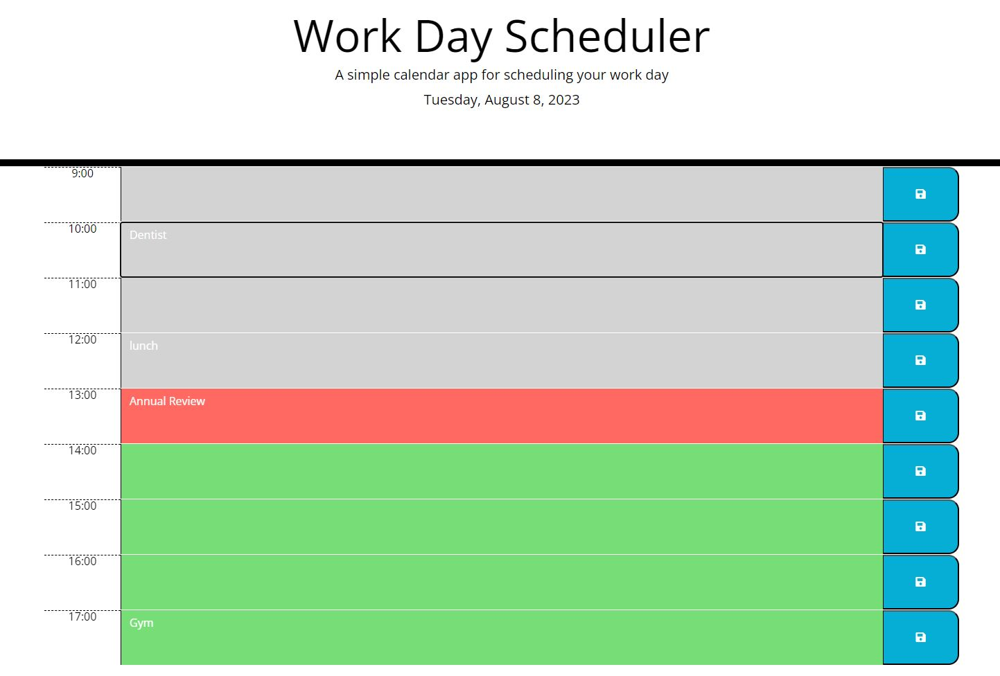

# Personal-Portfolio
## Description
This repository houses The Daily Planner App, whihc is a browser-based tool designed to aid busy employees in effectively managing their schedules. By integrating advanced JavaScript, DOM manipulation, and third-party APIs, the app provides an intuitive platform for scheduling events. Powered by jQuery, it offers dynamic updates of HTML and CSS to ensure a seamless user experience.

Developed with user experience in mind, the app generates timeblocks for standard business hours, adapting as the user scrolls. These timeblocks are color-coded for instant recognition of past, present, and future events. Through jQuery, users can easily input event details, with data persistently stored in local storage to survive page refreshes.

The development process involved mastering the javaScript for precise date and time manipulation within the browser. This project emphasized the importance of effectively implementing external documentation. It honed skills in advanced JavaScript techniques and demonstrated jQuery's prowess in dynamic content updates and user interaction. The Daily Planner App stands as a testament to creating practical applications by blending diverse technologies to deliver a user-centered solution.

- [Installation](#installation)
- [Usage](#usage)
- [Credits](#credits)
- [Link](#link)
- [License](#license)
- [Badges](#badges)

## Installation
- produce a reospiteory on GitHUB
- cloned the repository on my Desktop using the SSH Key
- Customised the content of the website by adding JavaScript
## Usage

## Credits
There were no collaborators for this project.

## Link
https://saad-054.github.io/Daily-Planner_App/

## License
MIT License

Copyright (c) 2023 Saad Siddiqui

Permission is hereby granted, free of charge, to any person obtaining a copy
of this software and associated documentation files (the "Software"), to deal
in the Software without restriction, including without limitation the rights
to use, copy, modify, merge, publish, distribute, sublicense, and/or sell
copies of the Software, and to permit persons to whom the Software is
furnished to do so, subject to the following conditions:

The above copyright notice and this permission notice shall be included in all
copies or substantial portions of the Software.

THE SOFTWARE IS PROVIDED "AS IS", WITHOUT WARRANTY OF ANY KIND, EXPRESS OR
IMPLIED, INCLUDING BUT NOT LIMITED TO THE WARRANTIES OF MERCHANTABILITY,
FITNESS FOR A PARTICULAR PURPOSE AND NONINFRINGEMENT. IN NO EVENT SHALL THE
AUTHORS OR COPYRIGHT HOLDERS BE LIABLE FOR ANY CLAIM, DAMAGES OR OTHER
LIABILITY, WHETHER IN AN ACTION OF CONTRACT, TORT OR OTHERWISE, ARISING FROM,
OUT OF OR IN CONNECTION WITH THE SOFTWARE OR THE USE OR OTHER DEALINGS IN THE
SOFTWARE.

## Badges

